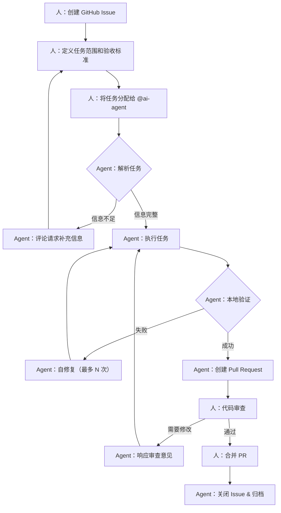

# AI Agent 开发工作流 v2（简化版）

## 核心原则

### 1. 人工决策，Agent 执行
- **任务创建与维护**：由项目所有者（人）在 GitHub Project/Issue 中完成
- **触发机制**：当任务分配给特定的 "Agent 用户"（如 `@ai-assistant`）后，Agent 才开始全面接手
- **职责边界**：Agent 不主动创建任务，只执行已明确分配的任务

### 2. 简化流程，减少噪音
- 去除过度复杂的 Phase 划分和多角色 Agent 设计
- 聚焦核心：任务接收 → 执行 → 反馈
- 保留必要的质量门禁，去除冗余审批环节

### 3. 清晰的观测与回滚
- 所有操作可追踪、可审计
- 失败时有明确的回滚路径和人工介入点

---

## 核心工作流



---

## 关键节点说明

### 1. 任务创建阶段（人工）

**任务模板**：
```markdown
## 任务描述
[清晰的功能描述或问题说明]

## 验收标准
- [ ] 标准 1：...
- [ ] 标准 2：...

## 技术范围
- 涉及的文件/模块：...
- 技术约束：...

## 非目标（可选）
- 本次不涉及的功能：...

## 回滚方案（可选）
- 如果失败，如何回滚：...
```

**触发条件**：
- 在 GitHub Project 中创建 Issue
- 将 Issue Assignee 设置为 `@ai-agent`（或配置的 Agent 账号）
- 标记状态为 `In Progress`

### 2. 任务解析阶段（Agent）

Agent 执行：
1. 读取 Issue 内容
2. 提取关键信息（描述、验收标准、范围）
3. 识别受影响的代码文件
4. **若信息不完整**：在 Issue 中评论请求补充，并停止执行
5. **若信息完整**：继续执行

### 3. 任务执行阶段（Agent）

Agent 执行循环：
1. **规划**：基于任务描述和上下文生成执行计划
2. **编码**：修改代码文件（Read/Write/Edit）
3. **验证**：运行质量检查
   - `ruff`：代码风格
   - `pytest`：单元测试
   - `mypy/pyright`：类型检查
4. **判断**：
   - 验证通过 → 进入下一步
   - 验证失败 → 自修复循环（最多 3 次）
   - 超过次数 → 评论请求人工介入

### 4. Pull Request 阶段（Agent + 人工）

Agent 执行：
1. 创建 PR，包含：
   - 改动摘要
   - 测试结果
   - 风险点说明
   - 回滚建议

人工执行：
1. 代码审查
2. 可选择：
   - 评论要求修改 → Agent 响应并重新执行
   - 批准合并 → 进入下一步
   - 关闭 PR → Agent 停止执行

### 5. 完成阶段

Agent 执行：
1. PR 合并后，自动关闭关联 Issue
2. 更新 GitHub Project 状态为 `Done`
3. 归档执行日志和决策记录

---

## 质量门禁

### 强制检查项

1. **代码风格**：`ruff check` 必须通过
2. **代码格式化**：`ruff format --check` 必须通过
3. **类型检查**：`mypy` 或 `pyright` 无错误
4. **单元测试**：`pytest` 全部通过
5. **安全扫描**：`bandit` 无高危漏洞

**注意**：以上检查在本地运行，不通过则不允许创建 PR。

### 可选检查项（可配置）

- 测试覆盖率阈值（如 80%）
- 性能基准测试
- 依赖安全检查（`pip-audit`）

---

## 失败处理策略

### 自修复循环

```
执行任务
  ↓
验证失败
  ↓
分析错误日志
  ↓
尝试修复（1/3）
  ↓
重新验证
  ↓
├─ 成功 → 继续
└─ 失败 → 重复（最多 3 次）
          ↓
        第 3 次失败 → 人工介入
```

### 人工介入触发点

Agent 在以下情况会停止执行并请求人工帮助：

1. **任务定义模糊**：无法理解 Issue 描述
2. **自修复耗尽**：3 次尝试后仍失败
3. **权限不足**：需要更高权限的操作
4. **架构疑问**：需要人工确认架构决策
5. **安全风险**：检测到潜在安全风险

---

## 配置示例

### `.agents/workflow.toml`

```toml
[workflow]
name = "ai-agent-workflow-v2"
version = "0.1.0"

# 触发配置
[trigger]
# 监听分配给哪个用户的任务
github_assignee = "@ai-agent"
# 监听哪个 GitHub Project 的列
github_project_column = "In Progress"

[agent]
# 使用的模型
model = "default"  # 可以是 qwen-max, gpt-4 等
# 最大自修复次数
max_self_heal_attempts = 3
# 单次任务超时（秒）
timeout_seconds = 3600

[context]
# 自动加载的上下文
auto_load_agents_md = true
auto_load_memory = true
# 最大上下文 token 数
max_context_tokens = 100000
# 包含/排除的文件模式
include_patterns = ["src/**/*.py", "tests/**/*.py"]
exclude_patterns = ["**/__pycache__", "**/.venv", "**/node_modules"]

[quality]
# 启用的质量检查
enabled_checks = ["ruff", "pytest", "mypy", "bandit"]
# pytest 配置
pytest_args = ["-v", "--tb=short"]
# ruff 配置
ruff_config = "pyproject.toml"

[github]
# GitHub 集成
auto_create_pr = true
pr_title_template = "[AI Agent] {issue_title}"
pr_body_template = """
## 改动摘要
{summary}

## 测试报告
{test_report}

## 相关 Issue
Closes #{issue_number}

## 风险点
{risk_notes}

## 回滚建议
{rollback_suggestion}
"""

[notification]
# 通知配置（可选）
slack_webhook = "${SLACK_WEBHOOK}"
email_enabled = false

[logging]
# 日志配置
log_level = "info"  # debug, info, warn, error
log_dir = ".agents/logs"
# 是否保留成功日志
retain_success_logs = false
```

---

## 实施步骤

### Phase 1: 最小可行产品（MVP）

**目标**：实现基础流程，能接收任务并创建 PR

1. **实现 GitHub Webhook 监听器**
   - 监听 Issue 分配事件
   - 监听 Project 卡片移动事件

2. **实现任务解析器**
   - 读取 Issue 内容和评论
   - 提取任务描述和验收标准
   - 识别受影响的文件

3. **实现 Agent 执行引擎**
   - 封装底层 AI 工具调用（Read/Write/Edit/Bash）
   - 实现自修复循环逻辑
   - 支持质量检查集成

4. **实现 PR 创建**
   - 自动生成 PR 标题和描述
   - 关联 Issue
   - 添加标签（如 `ai-generated`）

**验收标准**：
- 手动创建一个测试 Issue 并分配给 Agent
- Agent 能自动执行任务并创建 PR
- PR 包含完整的改动摘要和测试报告

---

### Phase 2: 质量门禁加固

**目标**：确保代码质量和稳定性

1. **集成质量检查工具**
   - ruff（代码风格和格式化）
   - pytest（单元测试）
   - mypy/pyright（类型检查）
   - bandit（安全扫描）

2. **实现质量报告**
   - 在 PR 描述中展示检查结果
   - 失败时提供详细的错误信息

3. **实现失败处理**
   - 自修复循环
   - 人工介入机制

**验收标准**：
- 有质量问题的代码无法通过 Agent 流程
- Agent 能尝试自动修复常见问题（如代码格式化）
- 复杂问题会正确请求人工介入

---

### Phase 3: 可观测性增强

**目标**：可追踪、可审计、可优化

1. **实现日志系统**
   - 记录 Agent 的所有决策和操作
   - 记录工具调用和结果
   - 记录 token 消耗和成本

2. **实现监控仪表板**（可选）
   - Agent 执行成功率
   - 平均执行时间
   - 自修复成功率
   - 成本统计

3. **实现知识沉淀**
   - 成功/失败模式分析
   - Prompt 优化建议
   - 常见问题 FAQ

**验收标准**：
- 能查看任意任务的完整执行历史
- 能统计 Agent 的效果和成本
- 能识别需要优化的环节

---

## 常见问题

### Q1: 如何避免 Agent 执行危险操作？

**方案**：
- 沙盒执行环境（使用 Docker 或受限用户）
- 命令白名单机制
- 敏感操作必须人工审批
- 审计日志记录所有命令

### Q2: Agent 无法理解复杂任务怎么办？

**方案**：
- 任务必须遵循模板，提供清晰的验收标准
- 复杂任务拆分为多个子 Issue
- Agent 在不确定时主动提问，而非猜测

### Q3: 如何控制 Agent 的成本？

**方案**：
- 设置单次任务 token 上限
- 设置每日/每周预算上限
- 监控成本异常（如循环失败导致大量重试）
- 支持降级到更便宜的模型

### Q4: Agent 生成的代码质量如何保证？

**方案**：
- 强制质量门禁（测试、lint、类型检查）
- 所有代码必须经过人工审查
- Agent 不直接合并代码
- 定期进行代码质量审计

---

## 与 v1 版本的对比

| 维度 | v1 版本（旧） | v2 版本（新） |
|------|-------------|-------------|
| **任务创建** | Agent 可自动创建任务 | 人工创建，Agent 只执行 |
| **流程复杂度** | 5 个 Phase，数十个子任务 | 5 个核心节点，简单清晰 |
| **角色划分** | Planner/Coder/Reviewer/Release 等 | 单一 Agent 执行者 |
| **触发机制** | 不明确，自动监听 | 明确的 GitHub 分配触发 |
| **质量门禁** | 过度设计，审批链长 | 核心检查 + 人工审查 |
| **失败处理** | 复杂的状态机 | 简单的自修复 + 人工介入 |
| **可观测性** | 大量指标，难以维护 | 核心指标，实用为主 |

---

## 下一步行动

1. **验证核心流程**（本周）
   - 使用现有工具（CodeBuddy/Qwen CLI）手动模拟完整流程
   - 验证任务模板是否清晰有效
   - 验证质量门禁是否能捕获常见问题

2. **实现 MVP**（第 1-2 周）
   - 实现 GitHub Webhook 监听
   - 实现基础 Agent 执行引擎
   - 实现 PR 自动创建

3. **内部试点**（第 3-4 周）
   - 在低风险任务中试点
   - 收集反馈并优化
   - 完善文档和配置

4. **逐步推广**（第 5 周及以后）
   - 扩展到更多类型的任务
   - 根据实际使用数据优化 prompt 和配置
   - 沉淀最佳实践
