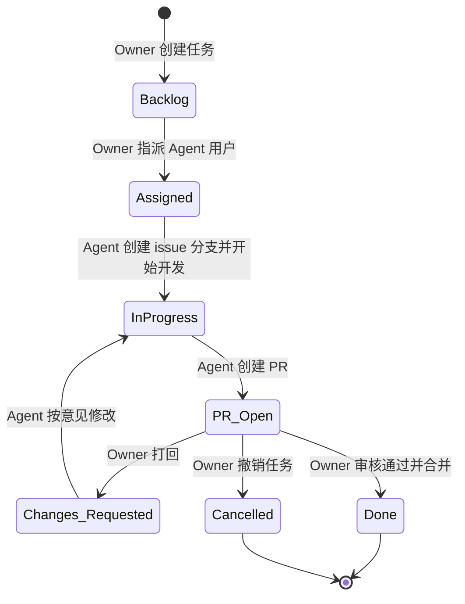

# AI 工作流（Codex V2，简化落地版）

## 1. 目标与范围

本版本只解决一件事：**先把“Owner 分配任务 -> Agent 开发 -> PR 审核 -> 完成/撤销”跑通**。  
暂不引入复杂编排、多 Agent、自动风险分级、安全审计与成本治理。

---

## 2. 综合评审结论（去噪 + 缺陷修正）

基于 `ai-workflow-codex.md`、`ai-workflow-gemini.md`、`ai-workflow-qwen.md`、`ai-workflow-codebuddy.md` 的共性和问题，V2 做如下收敛：

1. 去除“首版不必要复杂度”
   - 删除多输入源（Chat/Webhook/Dashboard）并行触发。
   - 删除多 Agent 角色拆分（Planner/Reviewer/Release）与复杂编排器。
   - 删除安全分级、审计、预算熔断等二期能力。
2. 修复 `ai-workflow-codex.md` 的一致性问题
   - 原文“流程图”和“状态机”粒度不一致：流程图含风险分级与发布沉淀，状态机未完整映射。
   - 原文状态机存在异常文案 `结构化需求成功2`，属于明显笔误。
   - V2 用一套状态同时驱动流程图和状态机，避免双轨定义冲突。
3. 明确 Owner 与 Agent 的边界
   - 任务创建/维护只由 Owner 负责。
   - 仅当 Owner 指派给指定 Agent 用户后，Agent 才接管执行链路。

---

## 3. 角色与职责

- Owner（项目所有者）
  - 创建与维护 Issue/Project 任务。
  - 指派任务给 Agent 用户。
  - 审核 PR，并做出：通过合并 / 打回修改 / 撤销关闭 的决定。
- Agent（特殊 agent 用户）
  - 接收被指派任务后，在 devcontainer 中创建 issue 分支。
  - 完成开发、测试、提交与 PR 创建。
  - 根据 Review 意见继续迭代，直到通过或被撤销。

---

## 4. 统一状态定义（唯一状态源）

任务状态仅保留以下 7 个：

1. `Backlog`：Owner 已创建，未指派。
2. `Assigned`：Owner 已指派给 Agent 用户。
3. `InProgress`：Agent 已创建 issue 分支并开始开发。
4. `PR_Open`：Agent 已创建 PR，等待 Owner 审核。
5. `Changes_Requested`：Owner 打回，等待 Agent 修改。
6. `Done`：Owner 审核通过并完成合并。
7. `Cancelled`：Owner 撤销任务（关闭 PR，删除 issue 分支）。

状态迁移约束：
- `Changes_Requested` 只能回到 `InProgress`。
- `Done` 与 `Cancelled` 为终态。
 

---

## 6. 状态机（与流程图一一对应）

---

## 7. 最小执行规范（首版）

1. 任务入口
   - 仅使用 GitHub Issue + Project。
2. 指派触发
   - 只有 Owner 执行指派动作后，Agent 才开始处理。
3. 分支规范
   - 每个 Issue 独立分支，建议：`issue/<issue-id>-<short-name>`。
4. 执行环境
   - Agent 必须在 devcontainer 内开发与测试。
5. PR 规则
   - 一个 Issue 对应一个主 PR（后续更新走同一 PR）。
6. 审核决策
   - 仅 Owner 有最终决策权：`merge` / `request changes` / `close(cancel)`。

---

## 8. V1 非目标（刻意不做）

- 多 Agent 协作编排。
- 自动风险分级与审批流。
- 安全审计、权限细分、成本熔断。
- 自动发布与复杂可观测平台。

以上能力在流程跑通后，再进入 V2.x/V3 迭代。
