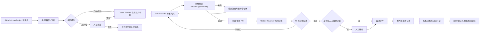
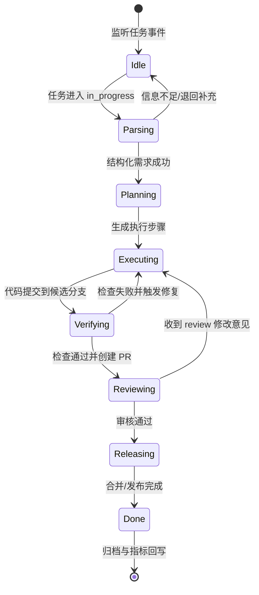

# 全托管 AI Agent 开发工作流（Codex）

## 目标
建立“任务定义 > 自动执行 > 自动反馈 > 持续优化”的全托管研发闭环，以 GitHub Project 为任务中枢，以 Codex Agent 为执行核心。

## 1. 层级任务（TODO）

### 1.1 治理与边界
- [ ] 定义自动化边界：明确 Agent 可自动执行与必须人工审批的动作清单。
- [ ] 定义风险分级：按低/中/高风险任务制定不同审批策略。
- [ ] 建立回滚机制：为每类发布动作定义可验证的回滚路径。

### 1.2 任务模型与流转
- [ ] 统一任务入口：仅允许通过 GitHub Issues/Project 创建任务。
- [ ] 建立任务模板：包含背景、验收标准、范围、非目标、回滚说明。
- [ ] 定义状态机：`todo -> in_progress -> review -> done -> archived`。
- [ ] 绑定状态事件：状态变更自动触发 Agent 编排流程。

### 1.3 Agent 编排与执行
- [ ] 划分 Agent 角色：Planner、Coder、Reviewer、Release。
- [ ] 设计编排规则：失败重试、超时中断、人工接管、幂等执行。
- [ ] 实现上下文注入：自动收集受影响文件、接口定义、历史 PR 与约束文档。
- [ ] 建立自修复循环：编码失败后自动读取日志并二次修复（上限 N 次）。

### 1.4 工程质量门禁
- [ ] 提交前强制检查：`ruff`、单元测试、类型检查、安全扫描。
- [ ] PR 阶段强制检查：CI 通过后才允许进入合并队列。
- [ ] 自动生成变更摘要：输出改动范围、风险点、测试结果与回滚建议。
- [ ] 失败标准化归因：把失败原因沉淀为规则或可复用 skill。

### 1.5 安全与权限
- [ ] 实施最小权限：按仓库、分支、动作拆分 Token 权限。
- [ ] 密钥集中托管：使用 GitHub Secrets/KMS，禁明文落地。
- [ ] 审计日志全量留痕：记录输入、命令、产物、审批、发布行为。
- [ ] 高风险动作审批：生产发布、权限变更、破坏性命令必须人工批准。

### 1.6 可观测与成本
- [ ] 建立核心指标：成功率、回滚率、平均交付时长、单任务成本。
- [ ] 建立告警机制：失败重试耗尽、预算超限、关键检查跳过时告警。
- [ ] 实施成本熔断：超过预算阈值自动降级为半托管模式。
- [ ] 建立周度复盘：持续优化提示词、规则、任务模板与技能包。

### 1.7 试点与推广
- [ ] 启动低风险仓库试点：先覆盖文档、脚手架、小功能改动。
- [ ] 扩展到核心模块：通过指标门槛后再扩大到关键业务模块。
- [ ] 发布组织级规范：沉淀通用流程、模板、审批策略、运维手册。
- [ ] 完成平台化：支持多仓库复用与跨团队标准接入。

## 2. 工作流图

## 3. Agent 状态机

## 4. 里程碑（建议）
- [ ] M1（第 1-2 周）：完成任务模板、状态机、基础编排与质量门禁。
- [ ] M2（第 3-4 周）：接入审计、审批、告警与成本控制。
- [ ] M3（第 5-8 周）：扩展多仓库、发布治理、平台化复用。
