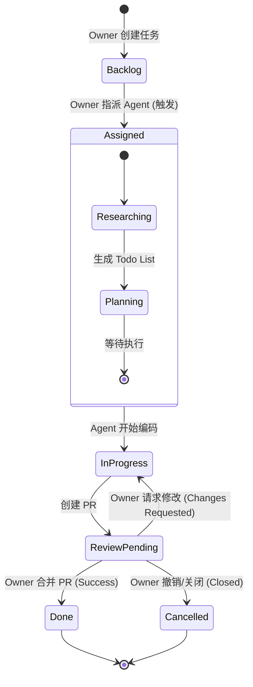

# nbcode AI Native 开发工作流 (V2 简化落地版)

## 1. 核心哲学
**"人领任务，机跑执行"**：项目所有者 (Owner) 掌控产品方向和任务定义，AI Agent (Agent) 负责具体的技术实现、验证与交付。

---

## 2. 角色职责

### Owner (项目所有者/人)
- **任务维护**：在 GitHub Project/Issue 中创建、描述和排定任务优先级。
- **显式指派**：通过修改 Issue 的 `Assignee` 为特定的 Agent 用户来激活自动化流程。
- **决策审计**：审核 Agent 提交的执行计划 (Todo List) 和最终的 Pull Request (PR)。

### Agent (特殊 Agent 用户/机)
- **方案细化**：接管任务后，立即进行代码分析，并在原 Issue 中生成结构化的执行计划（即“创建/细化问题”）。
- **闭环执行**：在独立的分支上进行编码、本地测试和 Lint 检查。
- **交付反馈**：提交代码并创建 PR，根据 Owner 的反馈进行迭代修改。

---

## 4. 任务状态机 (FSM)

---

## 5. 执行规范

1. **指派即激活**：Agent 仅监听 `Assignee` 变更事件。一旦被指派，即刻进入工作状态。
2. **计划先行**：Agent 必须在开始写代码前，在 Issue 评论区或描述中更新任务拆解（Todo List），让 Owner 知道“它打算怎么做”。
3. **原子提交**：每个 Issue 对应一个独立分支 `issue/<id>-<desc>`。
4. **验证门禁**：PR 创建前，Agent 必须在本地（devcontainer）跑通所有存量测试及新增测试。
5. **环境一致性**：所有执行动作必须在受控的容器环境或 `uv` 虚拟环境中运行。

---

## 6. 去除的噪音与缺陷（V1 vs V2）

- **删除多角色 Agent 编排**：不再区分 Planner/Coder/Reviewer，统一由一个全能 Agent 完成，降低通信损耗。
- **删除复杂风险分级**：初版所有任务均遵循统一流程，高风险任务通过 Owner 审核 PR 来把关。
- **简化触发机制**：废弃 Webhook/Dashboard 等多头触发，统一回归到 GitHub 原生操作（Assign/Comment）。
- **强化 Owner 主导权**：修复了 V1 中 Agent 可能“自作主张”开始未定义的任务的缺陷。

---

## 7. 下一步行动 (Implementation Checklist)

- [ ] **ACP 客户端升级**：确保 `nbcode` 能稳定处理 GitHub Assignee 变更事件。
- [ ] **Todo 注入器**：开发 Agent 自动更新 Issue 描述/评论的功能。
- [ ] **执行环境固化**：在 `pyproject.toml` 中定义标准化的测试与检查命令。
