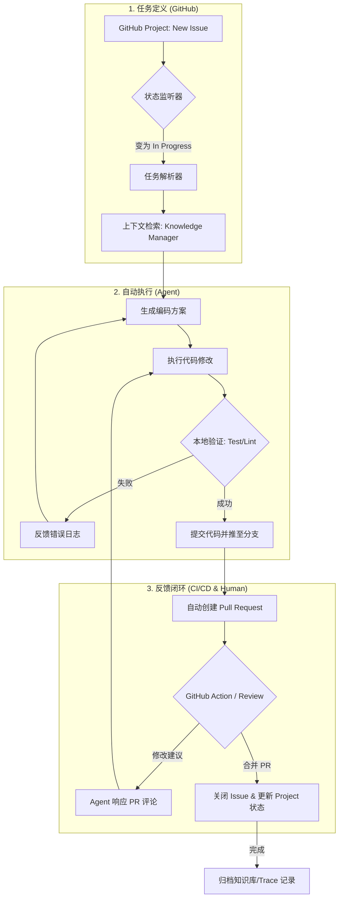
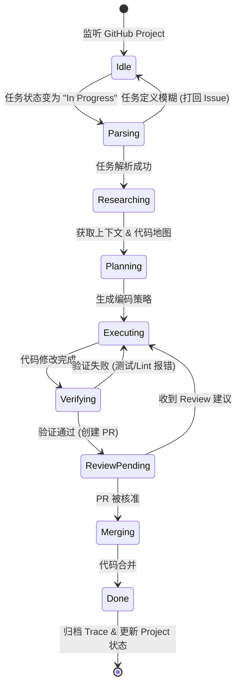

# AI Native 开发工作流设计 (AI-Workflow)

## 目标
实现“任务定义 > 自动执行 > 持续反馈”的闭环，利用 GitHub Project 作为任务流转中心。

## 1. 层级任务 (TODO)

### 1.1 基础设施与协议层
- [ ] **ACP 协议适配**：实现 `src/nbcode` 对标准 Agent Client Protocol 的完整支持。
- [ ] **沙盒执行环境**：配置基于 `uv` 或 `Docker` 的隔离环境，防止 Agent 执行危险命令。
- [ ] **知识库管理 (RAG)**：实现对项目文档 (`AGENTS.md`, `docs/`) 的实时索引，确保 Agent 具备最新的上下文。

### 1.2 任务触发与解析 (Task Definition)
- [ ] **GitHub Project 监听器**：
    - [ ] 监听任务移动至 "Todo" 或 "In Progress" 状态。
    - [ ] 自动提取 Issue 内容及关联的讨论记录。
- [ ] **上下文注入策略**：
    - [ ] 自动识别受影响的文件范围。
    - [ ] 提取相关的类型定义和 API 文档。

### 1.3 自动化编码与验证 (Execution)
- [ ] **自修复编码循环**：
    - [ ] Agent 执行代码修改。
    - [ ] 自动运行 `pytest` / `ruff` / `mypy`。
    - [ ] 若失败，将错误日志反馈给 Agent 进行二次修复（最多尝试 N 次）。
- [ ] **代码质量保证**：集成 linting 和 formatting 强制规范。

### 1.4 闭环反馈 (Feedback Loop)
- [ ] **PR 自动化管理**：
    - [ ] 验证通过后，自动创建或更新 Pull Request。
    - [ ] 在 PR 描述中生成改动摘要和测试结果报告。
- [ ] **Review 响应机制**：
    - [ ] 监听 PR 中的评论，触发 Agent 针对评论进行修改。
- [ ] **状态同步**：任务完成后，自动将 GitHub Project 状态更新为 "Done"。

---

## 2. 工作流流程图

---

## 3. Agent 任务状态机 (FSM)

利用有限状态机描述 Agent 处理任务的逻辑流转，这有助于实现更健壮的自动化控制。

### 状态说明：
- **Idle**: 等待新的 GitHub Issue 或 Project Card 移动到处理队列。
- **Parsing**: 将自然语言描述转化为结构化的目标和技术指标。
- **Researching**: 调用 RAG 工具检索代码库、文档和相关依赖。
- **Verifying**: 自动运行项目的测试套件和 Lint 工具（如 `ruff`, `mypy`）。
- **ReviewPending**: 等待人类开发者的意见，此时 Agent 挂起，直到监听到评论更新。
