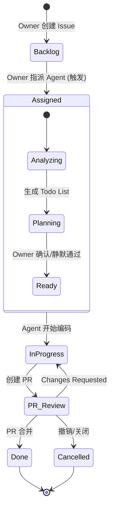

# nbcode AI Native 开发工作流 (V3 - Owner 主导简化版)

## 1. 核心哲学

**"Owner 创建任务，Agent 接管执行"**

- 任务的**创建和维护**完全由项目所有者 (Owner) 掌控
- 仅当 Owner **显式指派**给特定 Agent 用户后，Agent 才开始全面接手
- Agent 的首要动作：**在 Issue 中创建/细化执行计划**（Todo List）

---

## 2. 角色职责

### Owner (项目所有者/人)
| 职责 | 说明 |
|------|------|
| **任务创建** | 在 GitHub Issue 中定义需求、验收标准 |
| **任务维护** | 更新优先级、补充信息、调整范围 |
| **显式指派** | 通过修改 `Assignee` 为特定 Agent 用户来激活流程 |
| **计划审核** | 确认 Agent 提交的执行计划（可静默通过） |
| **PR 决策** | 审核 PR：合并 / 打回 / 撤销 |

### Agent (特殊 Agent 用户/机)
| 职责 | 说明 |
|------|------|
| **任务接管** | 监听 `Assignee` 变更，被指派后立即激活 |
| **计划细化** | 分析代码库，在 Issue 中生成结构化 Todo List |
| **闭环执行** | 创建分支 → 编码 → 本地测试 → Lint 检查 |
| **交付反馈** | 提交代码并创建 PR，响应 Review 意见迭代 |

---


## 4. 任务状态机 (FSM)



### 状态说明

| 状态 | 触发条件 | 责任方 |
|------|----------|--------|
| `Backlog` | Owner 创建 Issue | Owner |
| `Assigned` | Owner 指派 Agent | Owner → Agent |
| `InProgress` | Agent 开始编码 | Agent |
| `PR_Review` | PR 已创建 | Owner |
| `Done` | PR 合并 | Owner |
| `Cancelled` | 撤销任务 | Owner |

---

## 5. 执行规范

### 5.1 触发规则
- **唯一触发器**：GitHub Issue 的 `Assignee` 变更
- **激活条件**：仅当 Assignee 为配置的 Agent 用户时响应
- **静默期**：指派后 Agent 需在 N 分钟内响应

### 5.2 分支规范
```
分支命名：issue/<id>-<short-desc>
示例：issue/42-add-login-api
```

### 5.3 计划先行
Agent 必须在编码前在 Issue 中输出：
```markdown
## 执行计划

- [ ] 步骤 1: xxx
- [ ] 步骤 2: xxx
- [ ] 步骤 3: xxx

预计影响文件：
- src/xxx.py
- tests/xxx.py
```

### 5.4 验证门禁
PR 创建前必须通过：
- `ruff check .`
- `pytest tests/`
- 新增测试用例（如适用）

### 5.5 环境一致性
所有执行在以下环境之一：
- `uv` 虚拟环境
- devcontainer
- Docker 沙盒

---

## 6. 配置示例

### `pyproject.toml` 中的标准命令
```toml
[tool.nbcode.agent]
enabled = true
assignee_users = ["nbcode-agent", "qwen-agent"]
max_iterations = 50
timeout_seconds = 3600

[tool.nbcode.agent.checks]
lint = "ruff check ."
test = "pytest tests/"
type_check = "pyright"
```

### `.agents/config.toml`
```toml
[workflow]
name = "nbcode-v3"
version = "0.3.0"

[agent]
auto_create_plan = true      # 指派后自动生成 Todo List
require_plan_approval = false # 静默通过（true 则需 Owner 确认）
sandbox_mode = true

[github]
project_id = "chen56/nbcode"
auto_create_pr = true
branch_prefix = "issue/"
```

---

## 7. V3 vs 之前版本

### 去除的噪音
| 移除项 | 理由 |
|--------|------|
| 多输入源 (Chat/Dashboard/Webhook) | 统一用 GitHub Issue |
| 多 Agent 编排 (Planner/Coder/Reviewer) | 单 Agent 全栈完成 |
| 风险分级与审批流 | 首版不需要 |
| 安全审计/成本熔断 | 过早优化 |
| 自动发布流程 | 跑通后再说 |
| 复杂 RAG/知识检索 | 直接用 Issue 上下文 |

### 修复的缺陷
| 缺陷 | V3 修复方案 |
|------|-------------|
| Agent 可能"自作主张" | 仅响应 Assignee 变更 |
| 流程图与状态机不一致 | 统一状态定义 |
| 触发机制多头 | 回归 GitHub 原生操作 |
| Owner 主导权弱 | 任务创建/维护完全由 Owner 掌控 |

---

## 8. 下一步行动 (Implementation Checklist)

### Phase 1: 核心触发器
- [ ] 实现 GitHub Assignee 变更事件监听
- [ ] 配置 Agent 用户白名单
- [ ] 实现 Issue 上下文读取

### Phase 2: 计划生成器
- [ ] Agent 自动在 Issue 中创建 Todo List
- [ ] 支持 Owner 确认/静默通过模式
- [ ] 计划模板标准化

### Phase 3: 执行闭环
- [ ] issue 分支自动创建
- [ ] 本地 test/lint 门禁集成
- [ ] PR 自动创建与状态同步

### Phase 4: 反馈迭代
- [ ] PR Review 评论监听
- [ ] Agent 自动响应修改
- [ ] 状态机完整实现

---

## 附录：典型任务执行流程

```
1. Owner 创建 Issue #42: "添加用户登录 API"
   - 描述需求、验收标准
   - 保持 Assignee 为空（Backlog 状态）

2. Owner 完善 Issue 后，指派给 @nbcode-agent
   - 触发 Agent 接管流程

3. Agent 被指派后：
   a) 读取 Issue #42 完整上下文
   b) 分析相关代码文件
   c) 在 Issue 中评论执行计划（Todo List）

4. Owner 查看计划：
   - 如无异议，静默通过（或评论确认）
   - 如有问题，评论要求修改

5. Agent 开始执行：
   a) 创建分支 issue/42-add-login-api
   b) 编码实现
   c) 本地运行 ruff/pytest
   d) 失败则自修复，成功则继续

6. Agent 提交代码并创建 PR #43
   - 关联 Issue #42
   - 输出改动摘要

7. Owner 审核 PR：
   - 通过 → 合并 → 任务完成
   - 打回 → Agent 修改 → 重新提交
   - 撤销 → 关闭 PR → 任务取消
```
