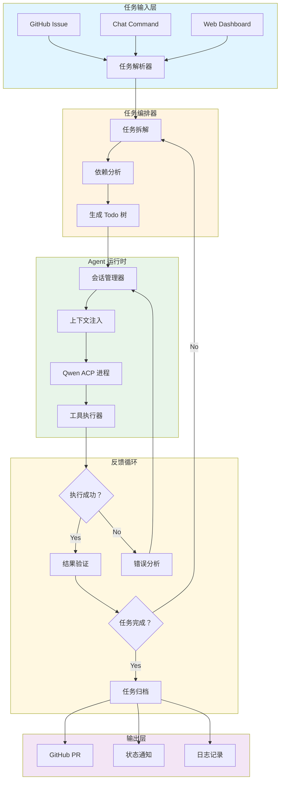
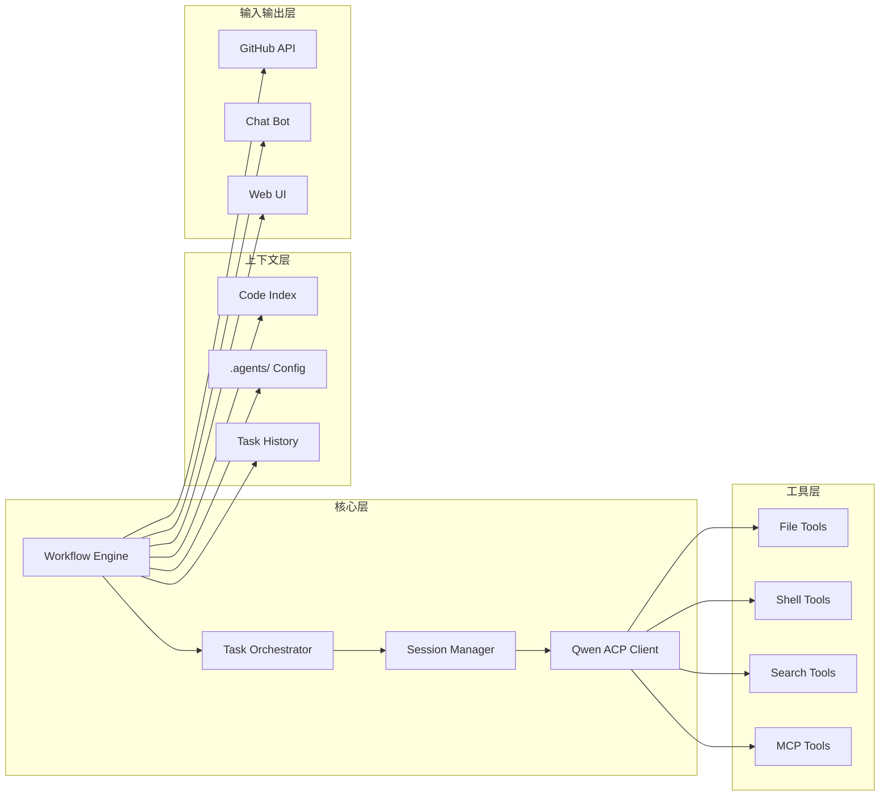

# Qwen AI Agent 全托管开发工作流

## 概述

本工作流基于 **Qwen CLI** 的 ACP (Agent Client Protocol) 协议，实现从任务定义 → AI 执行 → 反馈循环 → 任务完成的闭环自动化开发流程。

---

## 工作流图



---

## 层级任务 Todo

### Phase 1: 核心基础设施

- [ ] **1.1 Qwen ACP 封装器**
  - [ ] 1.1.1 实现 stdio 通信包装类
  - [ ] 1.1.2 实现 JSON-RPC 消息序列化/反序列化
  - [ ] 1.1.3 实现握手流程 (initialize → initialized)
  - [ ] 1.1.4 实现会话管理 (session/new, session/prompt)

- [ ] **1.2 上下文管理器**
  - [ ] 1.2.1 项目代码索引 (符号表生成)
  - [ ] 1.2.2 动态上下文注入策略
  - [ ] 1.2.3 `.agents/` 目录规范定义
  - [ ] 1.2.4 `llms.txt` 自动生成器

- [ ] **1.3 工具执行层**
  - [ ] 1.3.1 文件读写工具 (read_file, write_file, edit)
  - [ ] 1.3.2 命令执行工具 (run_shell_command)
  - [ ] 1.3.3 代码搜索工具 (grep_search, glob)
  - [ ] 1.3.4 工具调用结果格式化

---

### Phase 2: 任务编排系统

- [ ] **2.1 任务解析器**
  - [ ] 2.1.1 GitHub Issue Webhook 接收器
  - [ ] 2.1.2 自然语言任务提取
  - [ ] 2.1.3 任务优先级评估

- [ ] **2.2 任务拆解引擎**
  - [ ] 2.2.1 高层任务 → 原子操作拆解
  - [ ] 2.2.2 依赖关系图构建
  - [ ] 2.2.3 并行任务识别

- [ ] **2.3 Todo 树管理**
  - [ ] 2.3.1 Todo 状态追踪 (pending/in_progress/completed)
  - [ ] 2.3.2 子任务自动创建
  - [ ] 2.3.3 进度计算与报告

---

### Phase 3: 反馈与验证

- [ ] **3.1 执行验证器**
  - [ ] 3.1.1 代码语法检查 (ruff, pyright)
  - [ ] 3.1.2 单元测试运行
  - [ ] 3.1.3 构建验证

- [ ] **3.2 错误恢复机制**
  - [ ] 3.2.1 错误分类与重试策略
  - [ ] 3.2.2 回滚机制
  - [ ] 3.2.3 人工介入触发点

- [ ] **3.3 质量评估**
  - [ ] 3.3.1 代码审查检查点
  - [ ] 3.3.2 测试覆盖率阈值
  - [ ] 3.3.3 性能基准对比

---

### Phase 4: 集成与可观测性

- [ ] **4.1 GitHub 集成**
  - [ ] 4.1.1 Project 任务同步
  - [ ] 4.1.2 Pull Request 自动创建
  - [ ] 4.1.3 Commit 规范检查

- [ ] **4.2 通知系统**
  - [ ] 4.2.1 Slack/Discord 机器人
  - [ ] 4.2.2 邮件通知
  - [ ] 4.2.3 Web Dashboard 实时更新

- [ ] **4.3 日志与监控**
  - [ ] 4.3.1 Agent 决策链记录
  - [ ] 4.3.2 工具调用审计日志
  - [ ] 4.3.3 性能指标收集 (延迟、Token 消耗)

---

### Phase 5: 高级功能

- [ ] **5.1 多 Agent 协作**
  - [ ] 5.1.1 角色分工 (Coder/Reviewer/Tester)
  - [ ] 5.1.2 任务分配策略
  - [ ] 5.1.3 冲突解决机制

- [ ] **5.2 MCP 生态集成**
  - [ ] 5.2.1 数据库连接
  - [ ] 5.2.2 外部 API 调用
  - [ ] 5.2.3 自定义 MCP 服务器

- [ ] **5.3 自优化循环**
  - [ ] 5.3.1 执行历史分析
  - [ ] 5.3.2 Prompt 优化建议
  - [ ] 5.3.3 工具使用模式学习

---

## 核心组件架构



---

## 数据流示例

### 典型任务执行流程

```
1. 用户创建 GitHub Issue: "添加用户登录功能"
   ↓
2. Workflow Engine 捕获事件 → 创建 Task #001
   ↓
3. Task Orchestrator 拆解:
   - [ ] 创建用户模型
   - [ ] 实现认证 API
   - [ ] 添加登录页面
   - [ ] 编写测试用例
   ↓
4. Session Manager 启动 Qwen ACP 会话
   ↓
5. 循环执行每个子任务:
   a) 注入相关上下文 (现有模型、API 规范)
   b) 发送 prompt 给 Qwen
   c) 解析并执行工具调用
   d) 验证执行结果
   e) 更新 Todo 状态
   ↓
6. 所有子任务完成 → 创建 Pull Request
   ↓
7. 通知用户审查
```

---

## 配置文件示例

### `.agents/workflow.toml`

```toml
[workflow]
name = "nbcode-dev-workflow"
version = "0.1.0"

[agent]
model = "qwen-max"
max_iterations = 50
timeout_seconds = 3600

[context]
auto_index = true
max_context_tokens = 100000
include_patterns = ["src/**/*.py", "tests/**/*.py"]
exclude_patterns = ["**/__pycache__", "**/.venv"]

[tools]
enabled = ["file", "shell", "search", "git"]
sandbox_mode = true

[feedback]
auto_run_tests = true
auto_run_linter = true
require_human_approval = false

[integration.github]
enabled = true
project_id = "nbcode/dev-tasks"
auto_create_pr = true
```

---

## 下一步行动

1. **启动 Phase 1** - 实现 Qwen ACP 封装器和基础工具层
2. **创建原型** - 验证核心流程可行性
3. **迭代开发** - 按优先级逐步实现各阶段功能
