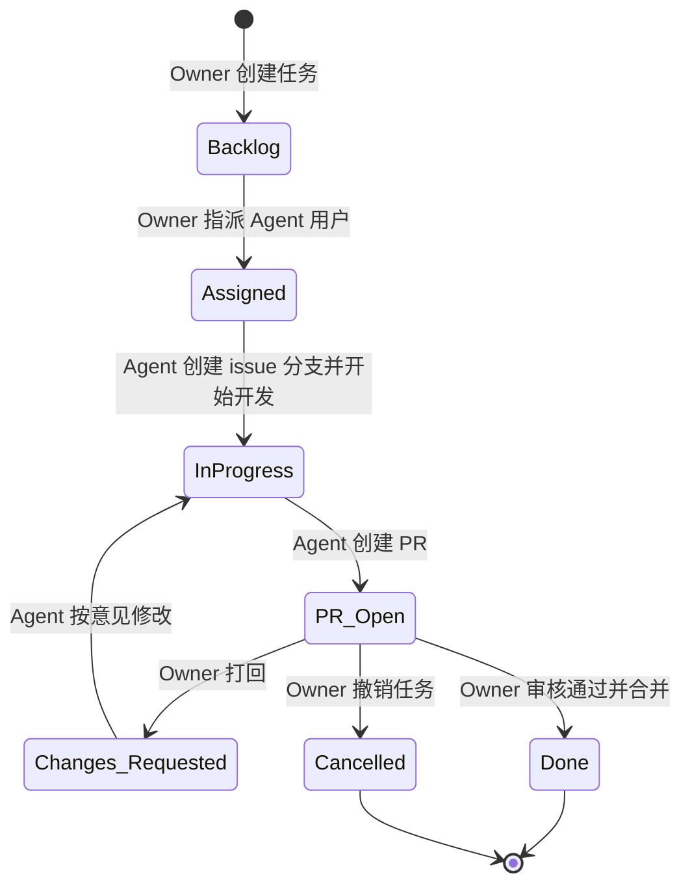

# AI 工作流（V1，简化落地版）

## 目标与范围

本版本只解决一件事：**先把“Owner 分配任务 -> Agent 开发 -> PR 审核 -> 完成/撤销”跑通**。  
暂不引入复杂编排、多 Agent、自动风险分级、安全审计与成本治理。

---

## 角色与职责

- Owner（项目所有者）
  - 创建与维护 Issue/Project 任务。
  - 指派任务给 Agent 用户。
  - 审核 PR，并做出：通过合并 / 打回修改 / 撤销关闭 的决定。
- Agent（特殊 agent 用户）
  - 接收被指派任务后，在 devcontainer 中创建 issue 分支。
  - 完成开发、测试、提交与 PR 创建。
  - 根据 Review 意见继续迭代，直到通过或被撤销。

---

## 4. 统一状态定义（唯一状态源）

任务状态仅保留以下 7 个：

1. `Backlog`：Owner 已创建，未指派。
2. `Assigned`：Owner 已指派给 Agent 用户。
3. `InProgress`：Agent 已创建 issue 分支并开始开发。
4. `PR_Open`：Agent 已创建 PR，等待 Owner 审核。
5. `Changes_Requested`：Owner 打回，等待 Agent 修改。
6. `Done`：Owner 审核通过并完成合并。
7. `Cancelled`：Owner 撤销任务（关闭 PR，删除 issue 分支）。

状态迁移约束：
- `Changes_Requested` 只能回到 `InProgress`。
- `Done` 与 `Cancelled` 为终态。
 

---

## 6. 状态机（与流程图一一对应）

---

## 7. 最小执行规范（首版）

1. 任务入口
   - 仅使用 GitHub Issue + Project。
2. 指派触发
   - 只有 Owner 执行指派动作后，Agent 才开始处理。
3. 分支规范
   - 每个 Issue 独立分支，建议：`issue/<issue-id>-<short-name>`。
4. 执行环境
   - Agent 必须在 devcontainer 内开发与测试。
5. PR 规则
   - 一个 Issue 对应一个主 PR（后续更新走同一 PR）。
6. 审核决策
   - 仅 Owner 有最终决策权：`merge` / `request changes` / `close(cancel)`。

---

## 8. 后续目标(非V1目标,刻意不做）

v1跑通后再考虑以下目标:

- 事件驱动：基于 GitHub Webhook 实现事件触发。
- 多 Agent 协作编排。
- 自动风险分级与审批流。
- 安全审计、权限细分、成本熔断。
- 自动发布与复杂可观测平台。
- 预算管理：监控成本，防止超出预算。
- 任务模版
- 复杂任务拆分为多个子 Issue的职责分配
- Agent 在不确定时主动提问，而非猜测
- 任务复盘报告、Prompt 优化建议、知识沉淀
- 可观侧性: 指标、日志、监控、告警
- 实现失败处理优化